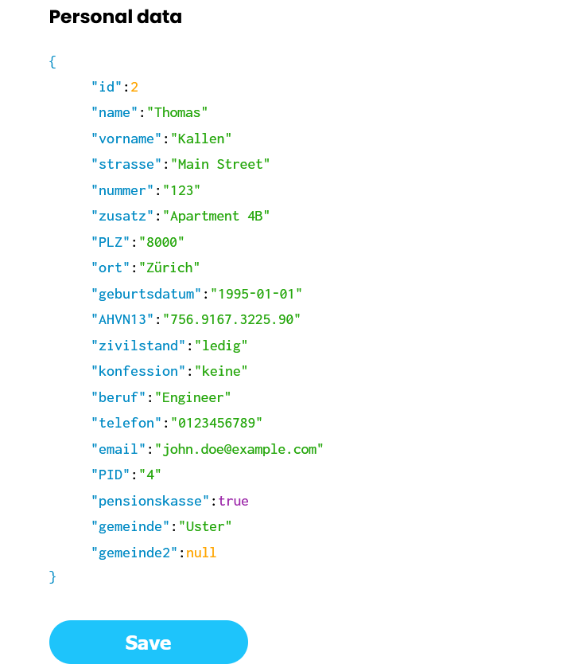

# Instruction

### Sidebars

Users sidebar displays list of all registered user ids, to add new user click `Add user` button. 
To the right is located a sidebar with preview options. 
`Personal Data` and `Wage Statements` buttons will display corresponding previews in
form of JSON.

### PersonalData

### WageStatements
To add or remove WageStatement click `,` character, press `Enter` to add new WageStatement, press `Backspace` to delete selected WageStatement

### Download

After clicking `Download` button, the tax form will be filled and sent to client as a file

